# Exercise 05: AirLLM, Quantization, and Local LLM Benchmarking

Deep technical report and reproducible software submission for Exercise 05 in the AI Agents
Orchestration course: **Running a Massive LLM Locally: AirLLM, Quantization and Performance
Benchmarking**.

## Executive Summary

This repository implements a reproducible local LLM experiment for three execution strategies:

- Direct Hugging Face Transformers inference.
- AirLLM-style layer paging.
- Quantized inference with bitsandbytes 8-bit loading and CPU offload.

The repository is configured and documented for the final 7B stress run with
`Qwen/Qwen2.5-7B-Instruct` on a constrained Windows laptop with 15.70 GiB RAM and an
NVIDIA GeForce RTX 3050 Laptop GPU with 4.0 GiB dedicated VRAM visible to CUDA. The experiment
uses two prompts, one run per prompt, and `max_new_tokens: 16`.

Current 7B result:

- Baseline Transformers inference succeeded on both prompts, but generation was slow.
- AirLLM now succeeds on both prompts after tokenizing prompts before calling AirLLM generation
  and pinning Transformers to the compatible 4.45.x series.
- Quantized inference now succeeds on both prompts with bitsandbytes 8-bit loading and fp32 CPU
  offload. The older CPU `dynamic_int8` path remains implemented for smaller CPU validation
  models, but it is not the final 7B mode because its conversion footprint is too large for this
  laptop's RAM.
- Analysis produced 6 rows: 6 successes and 0 failures.
- The configured cost model found no local/API break-even point in the tested monthly request
  volumes.

The strongest performance result is the quantized runner: it produced the highest throughput
and lowest latency in the final 7B run. AirLLM is valuable as a paging-style demonstration, but
on this machine it is slower than direct Transformers inference because layer movement and disk
I/O dominate the short generation workload.

Memory note: the committed CUDA/offload memory values are runner-level memory indicators gathered
from the execution stack. For the bitsandbytes CPU-offload run, the 8.32 GiB value should not be
interpreted as pure dedicated VRAM residency, because the physical GPU has only 4 GB dedicated
VRAM.

## Hardware And Model Choice

The hardware snapshot is generated by:

```bash
uv run airllm-ex05 hardware
```

Final observed hardware:

| Field | Value |
| --- | --- |
| OS | Windows 11 |
| Python | 3.12.13 |
| CPU | Intel64 Family 6 Model 140 Stepping 1, GenuineIntel |
| Physical cores | 4 |
| Logical cores | 8 |
| RAM | 15.70 GiB |
| GPU | NVIDIA GeForce RTX 3050 Laptop GPU |
| Dedicated GPU VRAM | 4.0 GiB |
| CUDA available | true |
| Storage | NTFS/FAT32 local partitions, about 932.68 GB each |

Selected stress model:

```text
Qwen/Qwen2.5-7B-Instruct
```

The model was chosen because a 7B FP16/BF16 checkpoint is far larger than the 4 GiB laptop GPU
can hold comfortably. This makes baseline failure, CPU offload, or severe latency a useful
assignment result rather than a surprise. The config keeps the prompt count and output length
small so the stress run can still produce bounded, auditable evidence.

## Reproducible Workflow

Install the base environment:

```bash
uv sync
```

Install optional model dependencies for real inference:

```bash
uv sync --extra models
```

Run the experiment:

```bash
uv run airllm-ex05 hardware
uv run airllm-ex05 baseline --config configs/experiment.yaml
uv run airllm-ex05 airllm --config configs/experiment.yaml
uv run airllm-ex05 quantized --config configs/experiment.yaml
uv run airllm-ex05 analyze --config configs/experiment.yaml
uv run airllm-ex05 report --config configs/experiment.yaml
```

Quality checks:

```bash
uv run ruff check .
uv run pytest
```

Current verification:

- Ruff: passed.
- Pytest: 35 passed.
- Coverage: 86.12%, above the configured 85% threshold.

## Configuration

The experiment is controlled by `configs/experiment.yaml`.

Final benchmark settings:

| Setting | Value |
| --- | --- |
| Model | `Qwen/Qwen2.5-7B-Instruct` |
| Prompts | 2 |
| Runs per prompt | 1 |
| Warmups | 0 |
| Max new tokens | 16 |
| Timeout | 900 seconds |
| Baseline mode | `transformers` |
| AirLLM shard path | `airllm_cache/qwen2_5_7b/layer_shards` |
| Quantization mode | `bitsandbytes` |
| Quantization bits | 8 |

The runner commands write raw local evidence under `results/raw/`. Raw result files are ignored
by Git because they can be noisy and machine-specific, but the processed comparison table and
figures are committed.

## Experiment Prompts

The final prompts were:

1. `Explain the difference between prefill and decode in local LLM inference.`
2. `Summarize why paging can help run a model that does not fit in VRAM.`

These prompts were chosen because they directly test the lecture concepts: Prefill, Decode,
TTFT, TPOT, paging, VRAM pressure, and local execution tradeoffs.

## Final Measurements

Processed evidence from `results/processed/comparison_table.csv`.

Current committed values should be regenerated from `results/processed/comparison_table.csv`
and the figures under `results/figures/` after each fresh 7B workflow run.

| Runner | Status | Prompt | Load s | Latency s | TTFT s | TPOT s/token | Tok/s | Peak RAM MB | CUDA/offload memory MB |
| --- | --- | ---: | ---: | ---: | ---: | ---: | ---: | ---: | ---: |
| airllm | success | 0 | 4.31 | 446.69 |  | 20.30 | 0.05 | 6373.56 | 1094.48 |
| airllm | success | 1 | 4.31 | 443.91 |  | 14.80 | 0.07 | 3943.98 | 1099.13 |
| baseline | success | 0 | 16.64 | 216.45 | 16.64 | 9.84 | 0.10 | 6564.54 | 4023.98 |
| baseline | success | 1 | 16.64 | 210.26 | 13.41 | 7.01 | 0.14 | 5694.49 | 4024.15 |
| quantized | success | 0 | 54.82 | 112.09 | 32.37 | 5.10 | 0.20 | 9528.06 | 8317.12 |
| quantized | success | 1 | 54.82 | 74.73 | 6.62 | 2.49 | 0.40 | 8028.14 | 8317.29 |

Aggregated summary:

| Runner | Load s | Avg latency s | Avg TTFT s | Avg TPOT s/token | Avg tok/s | Avg peak RAM MB |
| --- | ---: | ---: | ---: | ---: | ---: | ---: |
| airllm | 4.31 | 445.30 | unavailable | 17.55 | 0.06 | 5158.77 |
| baseline | 16.64 | 213.36 | 15.03 | 8.42 | 0.12 | 6129.52 |
| quantized bitsandbytes 8-bit | 54.82 | 93.41 | 19.50 | 3.79 | 0.30 | 8778.10 |

Analysis summary:

- Raw benchmark rows: 6.
- Successful rows: 6.
- Failed rows: 0.
- Break-even monthly request volume: none in the configured volume range.

## Figures

The outcome chart shows all three runners succeeded. The performance charts include baseline,
AirLLM, and quantized metrics from the final 7B run.

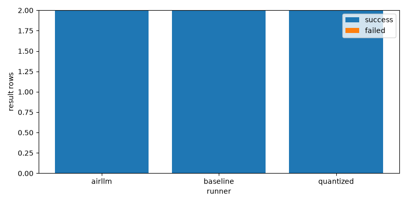

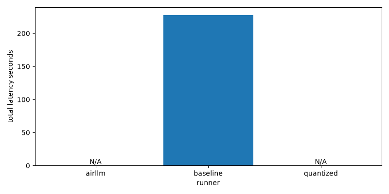

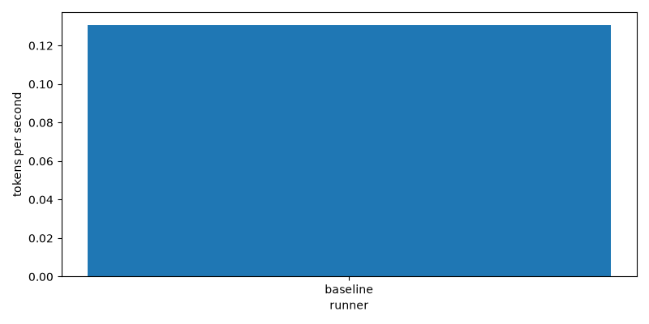

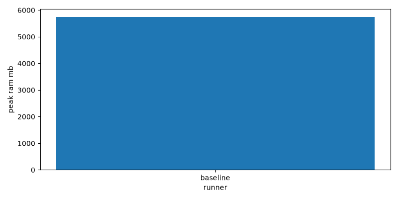

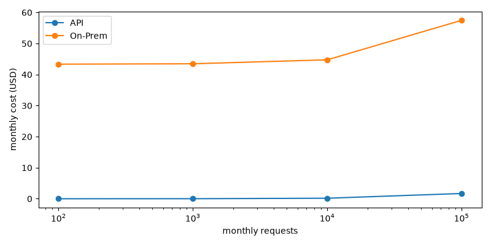

## Baseline Direct Inference

The baseline runner uses Transformers `AutoTokenizer` and `AutoModelForCausalLM`. The config
uses `device: auto`, so Transformers/Accelerate chooses the placement. The result recorded
about a 4.0 GB CUDA/offload runtime memory metric, which means this baseline was not CPU-only.

Observed 7B baseline behavior:

- Both final prompts succeeded.
- Model load time was about 16.64 seconds.
- Prompt 0 generation latency was 216.45 seconds.
- Prompt 1 generation latency was 210.26 seconds.
- Throughput ranged from 0.10 to 0.14 output tokens per second.
- TTFT ranged from 13.41 to 16.64 seconds.

Interpretation:

The model can run directly on this local machine, but the run is slow. The small laptop GPU is
visible, but the 4 GiB VRAM budget is too tight for comfortable 7B instruction-model work. Decode is
especially sensitive to memory bandwidth because each generated token requires repeated model
weight access. The larger TTFT on prompt 0 shows the user-visible startup cost of prompt
processing and first-token production.

## AirLLM Run

AirLLM was included because the lecture presents it as a paging-style strategy for local LLM
execution. Instead of keeping all weights resident at once, AirLLM shards layers and moves them
through memory. This is analogous to virtual memory and `mmap`: the system can address a model
larger than comfortable resident memory, but disk I/O becomes part of the inference path.

Observed 7B AirLLM behavior:

- The package imported successfully after dependency work.
- Prompt input is tokenized before generation and moved to the model device when available.
- Both final prompt rows succeeded.
- Model load time was about 4.31 seconds.
- Prompt latency was about 443.91 to 446.69 seconds.
- Throughput ranged from 0.05 to 0.07 output tokens per second.
- TTFT is not available because AirLLM does not use the same streaming path as the baseline and
  quantized Transformers runners.

Interpretation:

AirLLM succeeded, but it was the slowest observed generation path. The measured result supports
the lecture point that paging can make execution possible without making it fast: layer movement,
disk I/O, and framework overhead matter heavily on a short 7B laptop run.

## Quantization Run

The final 7B quantized path uses bitsandbytes 8-bit loading with CPU offload:

```text
BitsAndBytesConfig(load_in_8bit=True, llm_int8_enable_fp32_cpu_offload=True)
```

The CPU `torch.dynamic_int8` path remains implemented and tested for smaller validation models,
but it is not used for the final 7B run because its conversion footprint was too large for this
machine's RAM.

Observed quantized behavior:

- Both final prompt rows succeeded.
- Model load time was about 54.82 seconds.
- Prompt latency was about 74.73 to 112.09 seconds.
- Throughput ranged from 0.20 to 0.40 output tokens per second.
- TTFT ranged from 6.62 to 32.37 seconds.
- The CUDA/offload runtime memory metric was about 8.32 GiB with Accelerate CPU offload.

Interpretation:

Quantization was the fastest tested strategy for generation on this machine. It still has the
largest load cost and depends on bitsandbytes/Accelerate compatibility, but the final evidence
now supports a real latency and throughput comparison against baseline and AirLLM.

## Prefill, Decode, TTFT, And TPOT

The lecture separates inference into two phases:

- **Prefill** processes the input prompt and builds the initial context/KV state. This phase is
  often more compute-oriented because prompt tokens can be processed together.
- **Decode** generates output one token at a time. This phase is often memory-bandwidth-bound
  because each new token requires another pass through model weights.

The project measures:

- **TTFT**: time to first generated token. This approximates the user-visible startup delay and
  reflects prefill plus first-token work.
- **TPOT**: time per output token. This approximates steady decode cost.
- **Throughput**: output tokens per second.
- **Total latency**: end-to-end generation time for a prompt.

The baseline and quantized paths use streaming generation when available, so TTFT is measured
directly for those rows. AirLLM succeeded, but its current integration does not expose the same
streaming callback path, so AirLLM TTFT remains unavailable while latency, TPOT, throughput, RAM,
and CUDA/offload memory indicators are available.

## Memory And CUDA/Offload Analysis

The final machine has a CUDA-visible RTX 3050 Laptop GPU with 4.0 GiB dedicated physical VRAM
and 15.70 GiB host RAM. The benchmark records host RAM separately from the CUDA/offload runtime
memory metric in the comparison table. The baseline rows record about a 4.0 GB CUDA/offload
runtime memory metric. The quantized bitsandbytes rows record about 8.32 GB for that same
runner-level metric because Accelerate CPU offload can move part of the model/state through CPU
memory and CUDA/offload paths rather than keeping a simple 4 GiB-only GPU footprint.

The CUDA/offload memory column is a runner-level memory indicator gathered from the execution
stack. For the bitsandbytes CPU-offload run, it should not be interpreted as pure dedicated VRAM
residency, because the physical GPU has only 4 GB dedicated VRAM. The exact composition of this
runtime indicator is backend-dependent, so it is safest to read it as measured execution-stack
memory pressure rather than as physical GPU residency.

Important limitations:

- RAM is sampled periodically, so short spikes can be missed.
- Tokenizer and model internals can allocate memory outside the measured generation window.
- The final quantized run uses bitsandbytes, while the CPU dynamic-int8 path remains a smaller
  model validation option.
- AirLLM and quantized use different execution backends, so speed and memory comparisons should
  be interpreted as end-to-end local runner behavior rather than isolated algorithm benchmarks.

## Cost Analysis: On-Premises Versus API

The assignment requires a local/API economic comparison. This project models API token cost
against local hardware amortization, electricity, and maintenance.

Configured assumptions:

| Cost input | Value |
| --- | ---: |
| API input price | 0.15 USD / 1M tokens |
| API output price | 0.60 USD / 1M tokens |
| Cached input discount | 0.5 |
| Hardware cost | 1200 USD |
| Hardware lifetime | 36 months |
| Electricity | 0.20 USD / kWh |
| Average power | 180 W |
| Maintenance | 10 USD / month |
| Request volumes | 100, 1000, 10000, 100000 / month |

Cost curve summary:

| Monthly requests | API cost USD | Local cost USD | API/request USD | Local/request USD |
| ---: | ---: | ---: | ---: | ---: |
| 100 | 0.001695 | 43.584022 | 0.00001695 | 0.43584022 |
| 1000 | 0.016950 | 45.840219 | 0.00001695 | 0.04584022 |
| 10000 | 0.169500 | 68.402191 | 0.00001695 | 0.00684022 |
| 100000 | 1.695000 | 294.021908 | 0.00001695 | 0.00294022 |

No break-even point appears in the configured request volumes. The local cost is dominated by
hardware amortization and maintenance, while the API cost remains tiny for the short prompts
and low-to-moderate request counts used here.

Recommendation:

- Use an API for low-volume, bursty, or convenience-oriented workloads.
- Use local inference when privacy, offline execution, learning, control, or sustained high
  volume matters more than raw cost.
- This constrained laptop is useful for learning and experimentation, not for production-grade
  throughput.

## Output Quality Review

The final run uses only two prompts and 16 max new tokens, so output quality is a small manual
spot check rather than a full benchmark.

Observed samples:

- Baseline prompt 0 started a relevant explanation of prefill in local LLM inference.
- Baseline prompt 1 correctly described paging as memory management using external storage.
- AirLLM produced generated text for both final prompts, but it was much slower than baseline.
- Quantized produced generated text for both final prompts and was the fastest observed
  generation path.

Conclusion:

All three runners now produce reviewable output. Because the benchmark is intentionally only two
short prompts with 16 max new tokens, quality should be treated as a smoke check, not a broad
model-quality evaluation.

## Original Extension

Beyond the minimum assignment, this project adds a reproducible engineering harness:

- Typed YAML configuration with Pydantic.
- Structured success and failure JSON records.
- Runner-level CSV summaries.
- Processed comparison table generation.
- Cost-curve generation with API/local assumptions.
- Tests with fake model dependencies so CI does not need to download large models.
- Specialized PRDs for the benchmark harness, AirLLM path, and quantization path.

This extension makes the experiment rerunnable and auditable rather than a one-off notebook.

## Project Architecture

The project is organized as a Python package under `src/airllm_ex05/`.

| Module | Responsibility |
| --- | --- |
| `cli.py` | Command routing for hardware, runners, analysis, and report generation |
| `config.py` | YAML config parsing, validation, and path resolution |
| `models.py` | Hardware, metric, and benchmark result schemas |
| `hardware.py` | OS, CPU, RAM, GPU, CUDA, VRAM, and storage snapshot |
| `metrics.py` | Token estimates, throughput, TPOT, RAM sampler, CUDA/offload memory metric |
| `benchmark.py` | JSON/CSV result persistence |
| `runners/baseline_runner.py` | Direct Transformers inference |
| `runners/airllm_runner.py` | AirLLM loading, shard path, and generation attempt |
| `runners/quantized_runner.py` | `bitsandbytes`, CPU dynamic-int8, offload, and memory-guard paths |
| `cost_analysis.py` | API/local cost comparison and break-even scan |
| `plotting.py` | Latency, throughput, memory, and cost figures |
| `report.py` | Generated Markdown report support |

Additional documentation:

- `docs/PRD.md`: main product requirements.
- `docs/PLAN.md`: implementation plan.
- `docs/TODO.md`: implementation and submission ledger.
- `docs/ARCHITECTURE.md`: architecture and data-flow notes.
- `docs/PROMPTS.md`: prompt book and AI-assistance notes.
- `docs/PRD_airllm_pipeline.md`: AirLLM-specific requirements.
- `docs/PRD_benchmarking.md`: benchmark-specific requirements.
- `docs/PRD_quantization.md`: quantization-specific requirements.

## Repository Structure

```text
configs/                  Experiment configuration
docs/                     PRDs, plan, architecture, prompt log, report, TODO
results/figures/          Committed visual evidence
results/processed/        Committed processed comparison table
results/raw/              Local raw evidence, ignored except .gitkeep
scripts/                  Convenience wrappers
src/airllm_ex05/          Python package
tests/                    Offline/lightweight test suite
```

Ignored heavy/private artifacts:

- `documents/*.pdf`
- `.venv/`
- `model_cache/`
- `airllm_cache/`
- `results/raw/*.json`
- `results/raw/*.csv`
- model weights and shard files such as `*.safetensors`, `*.bin`, `*.gguf`
- `.env`

## Limitations

- The experiment is intentionally short.
- Token counts are approximate.
- RAM peaks are sampled and can miss brief spikes.
- Cost power values are assumptions, not watt-meter readings.
- AirLLM TTFT is unavailable because AirLLM is not integrated through the same streaming path.
- Package compatibility can change with future versions.
- The final comparison is an end-to-end runner comparison, not an isolated backend microbenchmark.

## Troubleshooting

- **Missing `transformers`**: run `uv sync --extra models`.
- **AirLLM failure**: verify `transformers>=4.42,<4.46` is installed and clear stale shards if
  they were created by an older model/config.
- **Windows quantization limits**: the final 7B config uses bitsandbytes 8-bit with CPU offload.
  Use `dynamic_int8` only for smaller CPU validation models because 7B conversion can exceed RAM.
- **Out of memory**: lower `max_new_tokens`, validate with a tiny model, then rerun the
  configured 7B stress model and preserve any structured failure rows as evidence.
- **Disk pressure**: Hugging Face caches and AirLLM shards can be large; keep them on a disk
  with sufficient free space.

## Screenshots

The committed plots above are the primary visual evidence. The assignment also asks for
screenshots in the README. Because several views do not fit into one readable capture, each
evidence group is stored under `docs/screenshots/<topic>/` with numbered PNG files.

README overview:

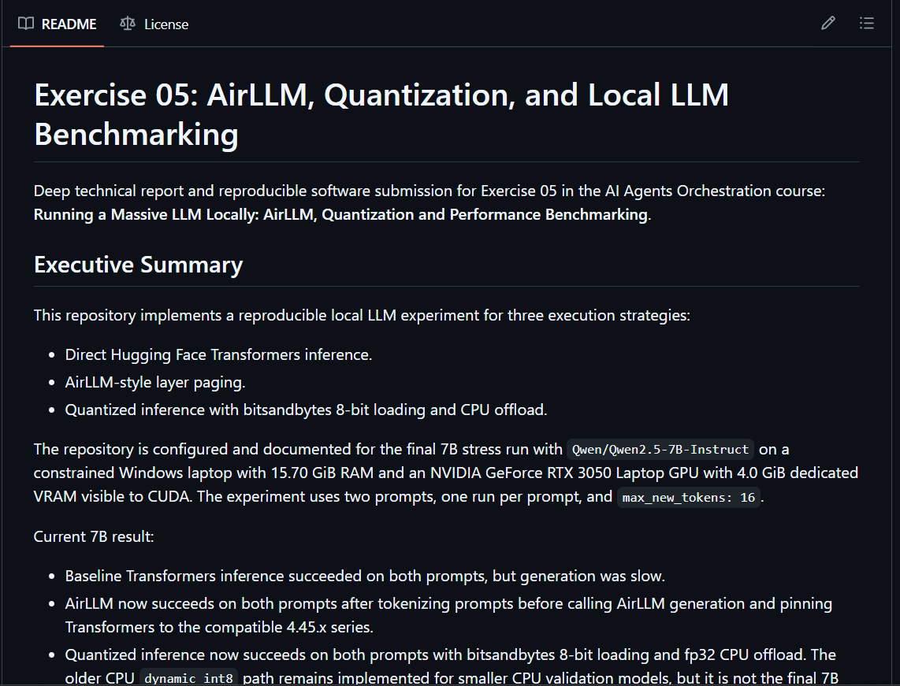
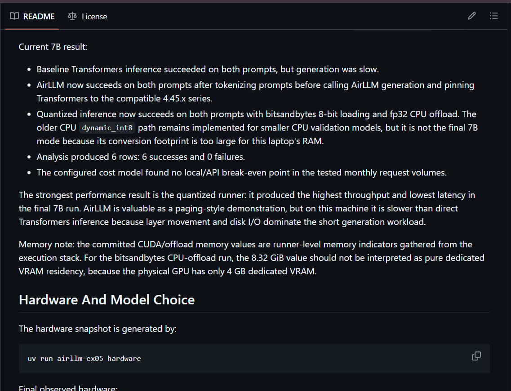
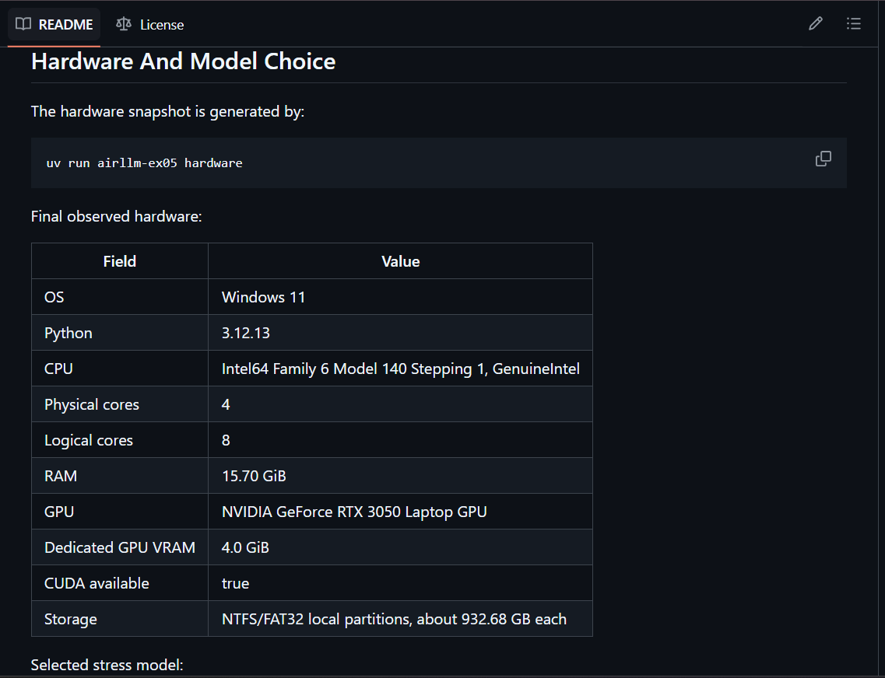
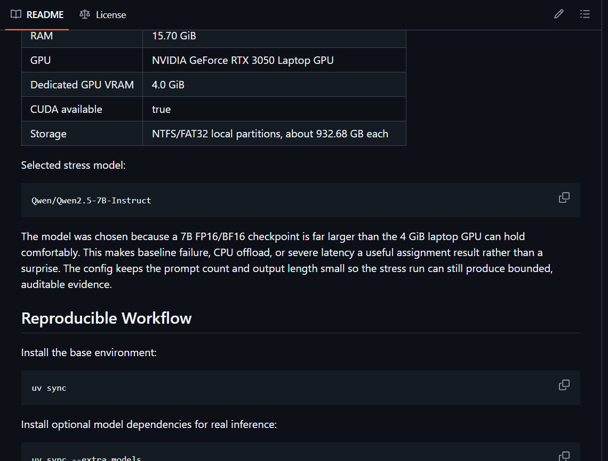

README figures:

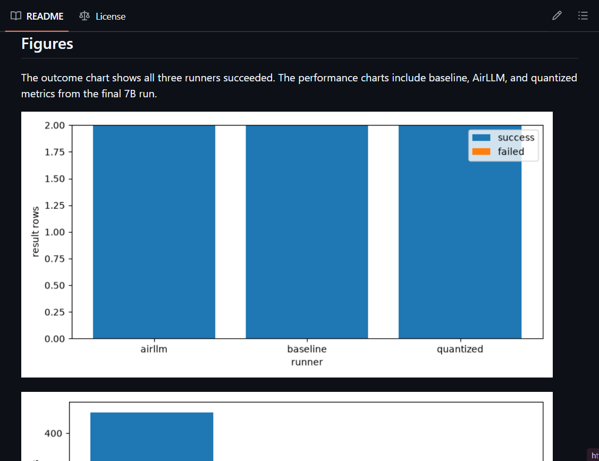
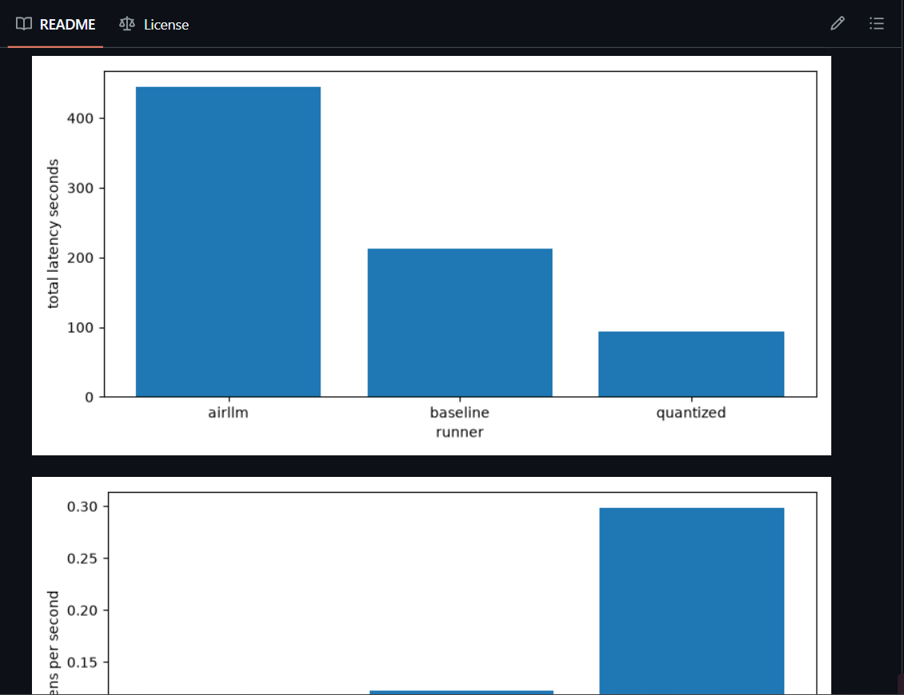
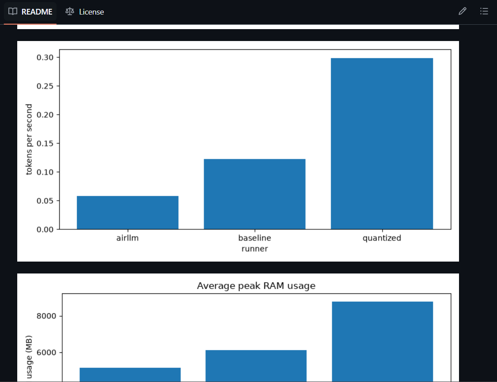
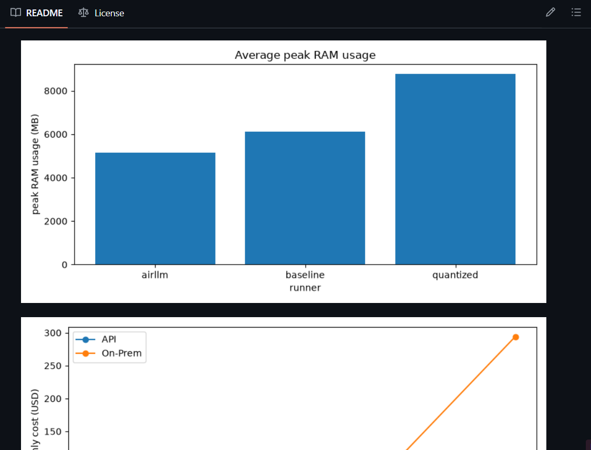
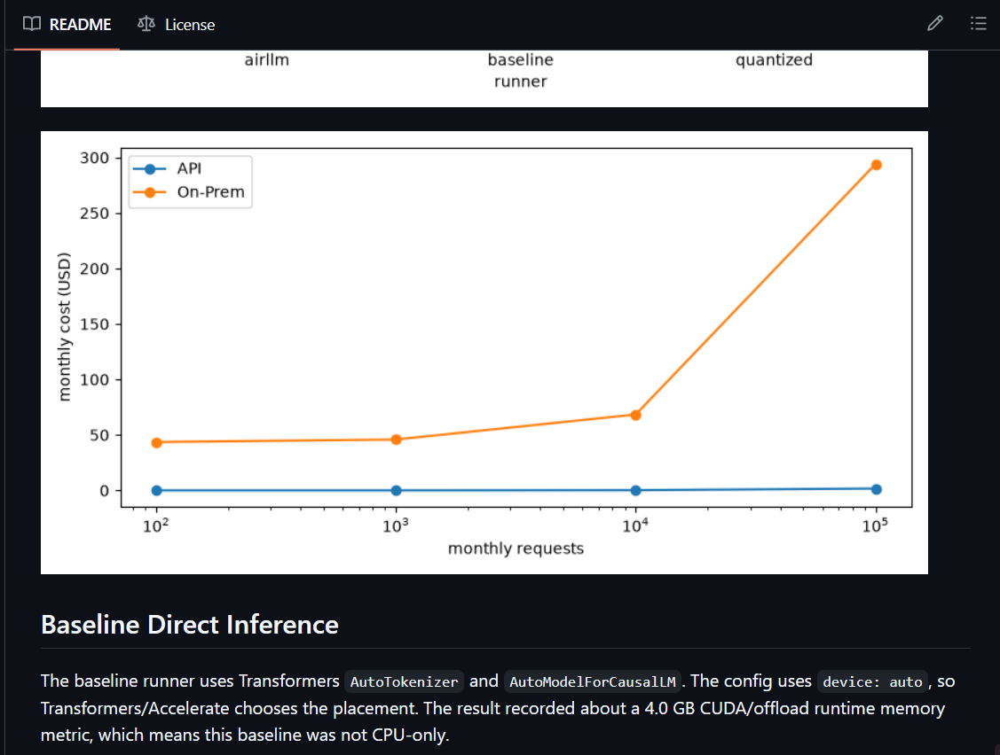

Hardware evidence:

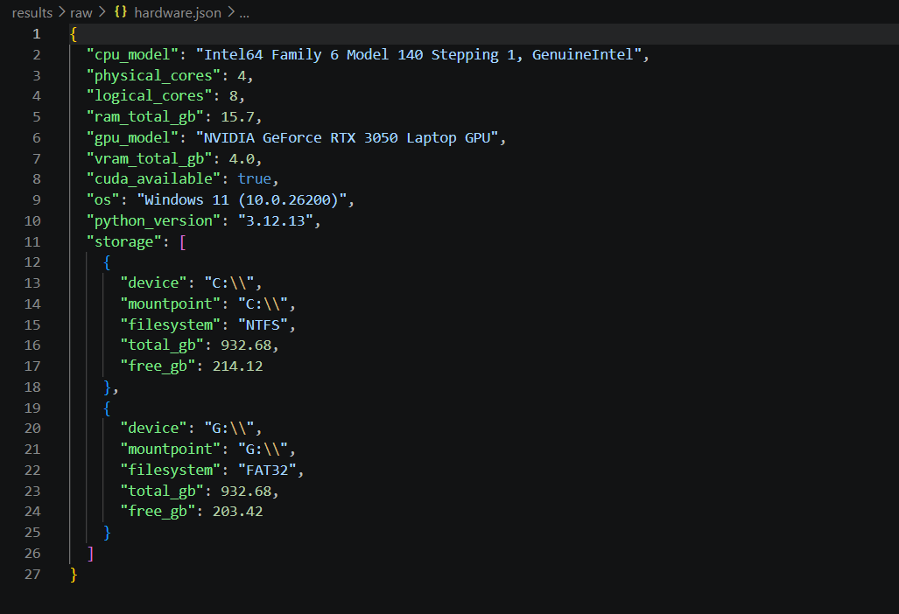

Comparison table:

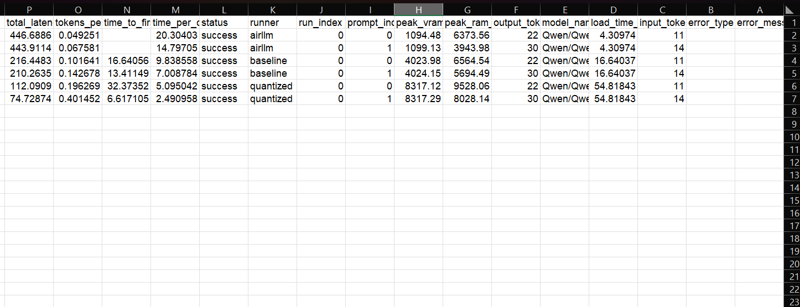

AirLLM shard-cache proof:

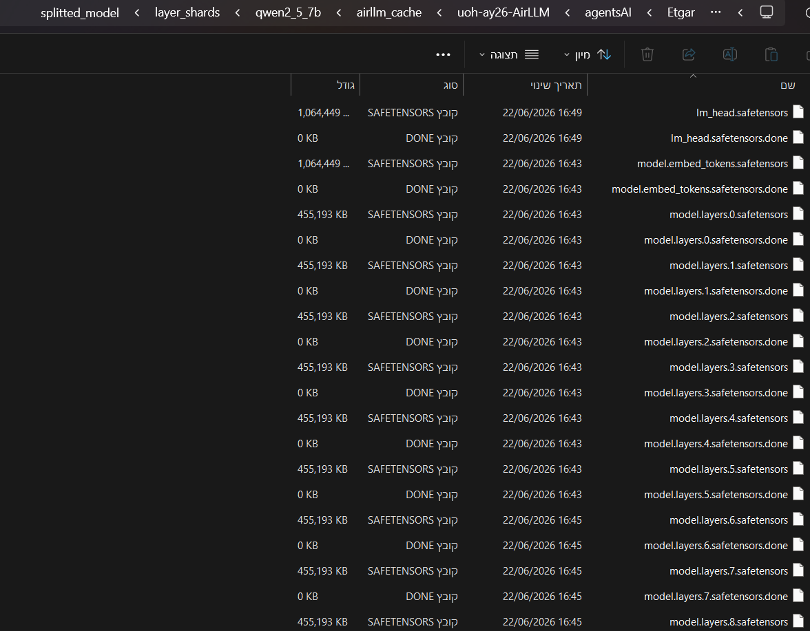

Quality checks:

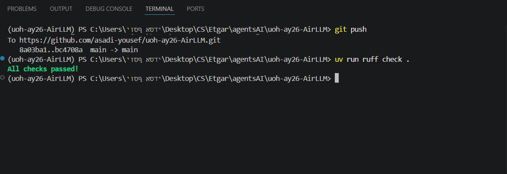
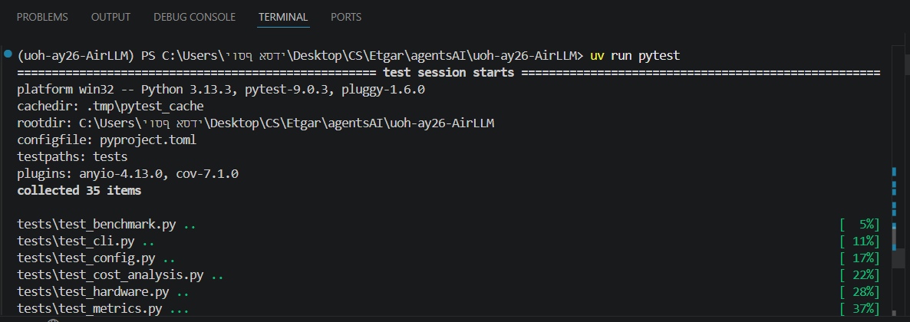
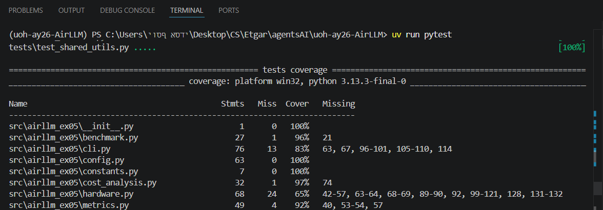
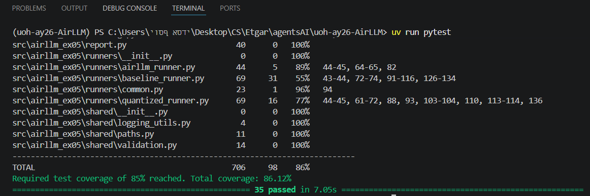

## Final Engineering Conclusion

This repository satisfies the assignment as an engineering experiment. It documents the
hardware, chooses and justifies a locally uncomfortable model, runs baseline/AirLLM/quantized
execution, measures TTFT/TPOT/throughput/latency/RAM/CUDA-offload memory where available,
generates tables and graphs, performs an API/local cost comparison, and
connects the findings to Prefill, Decode, VRAM, paging, and quantization.

The strongest finding is not that one method is universally best. The actual 7B result is more
engineering-realistic: direct local Transformers inference works but is slow, AirLLM succeeds
with paging but is slower, and bitsandbytes 8-bit offload produces the fastest generation while
requiring the most careful dependency and memory setup.

## Submission Readiness And Self Evaluation

Self-assessed grade: **90/100**.

I would not grade this as perfect because the final benchmark is intentionally short, AirLLM TTFT
is unavailable through the current integration, memory sampling is approximate, and cost power
values are assumptions rather than wall-meter measurements. I would grade it in the low 90s
because it satisfies the core assignment and software-submission requirements with reproducible
code, documented tradeoffs, final 7B evidence, screenshots, tests, and a clear explanation of
limitations.

Readiness against the assignment and software-guideline PDFs:

| Requirement | Status | Evidence |
| --- | --- | --- |
| Root README as main technical report | Complete | This README contains hardware, model choice, workflow, results, figures, screenshots, analysis, and limitations. |
| Hardware specification | Complete | Hardware table and `results/raw/hardware.json` screenshot. |
| Baseline local run | Complete | Baseline rows in the final table and latency/throughput discussion. |
| AirLLM or paging-style run | Complete | AirLLM rows, AirLLM section, and shard-cache screenshot evidence. |
| Quantization run | Complete | bitsandbytes 8-bit CPU-offload rows and quantization analysis. |
| Metrics: TTFT, TPOT, throughput, latency, memory | Complete with stated limits | Baseline/quantized TTFT available; AirLLM TTFT limitation is documented. |
| RAM/VRAM and memory-pressure explanation | Complete | Dedicated VRAM, host RAM, and CUDA/offload memory metric are separated. |
| API versus on-prem cost analysis | Complete | Cost table, curve, no break-even result, and recommendation. |
| Graphs, tables, screenshots | Complete | `results/figures/`, final comparison table, and `docs/screenshots/`. |
| Reproducible commands | Complete | `uv run` workflow and quality-check commands are documented. |
| PRD, PLAN, TODO, specialized PRDs | Complete | `docs/PRD.md`, `docs/PLAN.md`, `docs/TODO.md`, and specialized PRDs. |
| Prompt documentation | Complete | `docs/PROMPTS.md` records benchmark prompts and representative development prompts. |
| Tests and quality gate | Complete | `uv run pytest` passes with 86.12% coverage; threshold is 85%. |
| Ruff linting | Complete | `uv run ruff check .` passes. |
| Secrets/private/heavy artifacts excluded | Complete | `.gitignore` excludes PDFs, caches, raw results, model files, `.env`, and virtual environments. |
| License and credits | Complete | MIT license for implementation code and course/model-license caveat. |

## Contribution And Quality Gates

Use `uv` as the package and command runner. Keep source changes modular under `src/`, add or
update tests under `tests/`, and keep generated private/heavy artifacts out of Git. Before any
submission or meaningful change, run:

```bash
uv run ruff check .
uv run pytest
```

The project is configured to fail pytest when coverage drops below 85 percent.

## License And Credits

The implementation code is released under the MIT License in `LICENSE`.

Course assignment and lecture materials are credited to Dr. Yoram Segal and are not covered by
the repository code license. Model licenses depend on the selected Hugging Face model and must
be checked before use or sharing.
